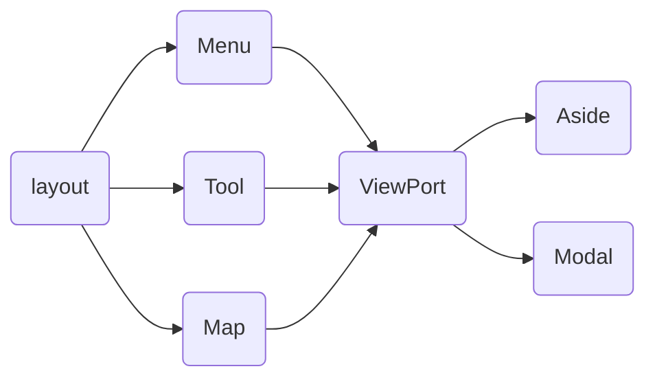
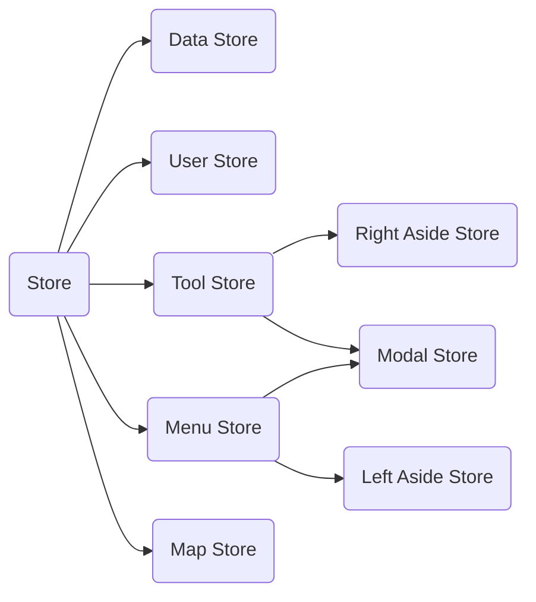

# 项目结构

---

- 布局包含三项，菜单、小工具、地图

- 原型设计: https://wt9r0s.axshare.com/#id=ma6xsl&p=%E6%A8%A1%E5%9E%8B%E7%AE%A1%E7%90%86

---

建立父子级关系，主要目的是为了组合子组件的交互
通过 pinia 的 getter 来控制

# 目录结构

├── App.vue  
├── assets
│ ├── base.scss
│ ├── img
│ └── scrollbar.css
├── components
│ ├── Test.vue
│ ├── bi-components
│ ├── common
│ ├── index.ts
│ └── inundation-analysis
├── config
│ ├── basemap.ts
│ ├── cesiumEnum.ts
│ ├── layers.ts
│ ├── menu.ts
│ └── tools.ts
├── controller
│ ├── index.ts
│ ├── layerController.ts
│ ├── layersController.ts
│ ├── mapController.ts
│ └── measure.ts
├── dictionary
│ └── index.ts
├── main.ts
├── request
│ ├── interceptor.ts
│ ├── request.ts
│ └── services.ts
├── stores
│ ├── menu.ts
│ ├── store.ts
│ ├── tools.ts
│ ├── viewport.ts
│ └── viewports
├── types
│ ├── auto-import.d.ts
│ ├── config.d.ts
│ ├── index.d.ts
│ ├── menu.d.ts
│ └── store.d.ts
└── utils
└── index.ts

# 通用组件

1. 如何抽离公共组件

- 分析组件是否足够通用
- 将组件放到对应的项目的 component 下,例如 inundation-analysis 文件夹下
- 如果在后续业务中场景有复现，则抽离至全局 components
- 判断这个公共组件是属于业务组件还是全局公用组件，放入 common 或 bi-components
